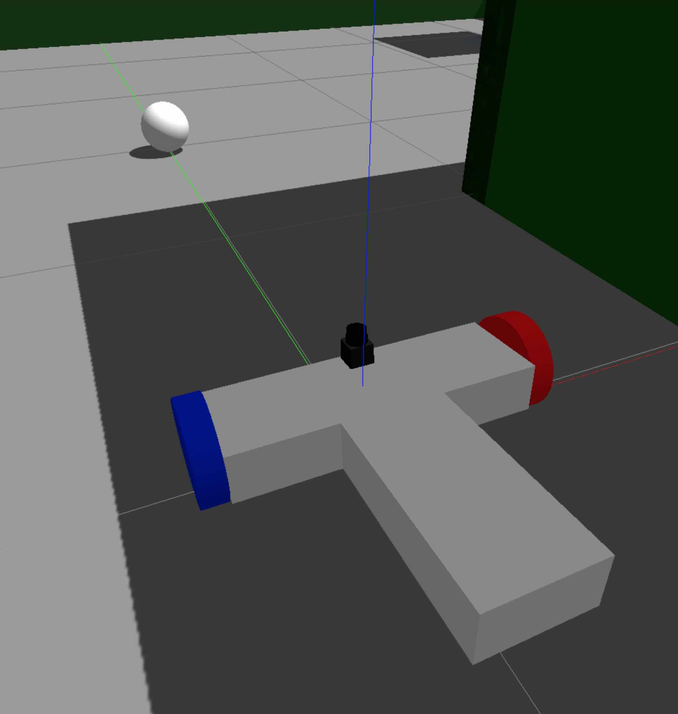

# Udacity Robotics Nanodegree
# Project #2: Go Chase It



## Introduction
This is a project for Udacity's Robotics NanoDegree. It's a robot that is capable of finding a white ball in a forward-facing camera, and driving toward it.

## Concepts and Classes
Concepts explored in this project:

  - Gazebo model and world-building
  - Gazebo plugins
  - URDF
  - ROS publishers, subscribers, and services
  - C++

## Getting Started
To view this project, you must have Gazebo and ROS installed on Linux.

[Click here for Gazebo download and installation instructions](http://gazebosim.org).

[Click here for ROS installation instructions](http://wiki.ros.org/ROS/Installation).

With Gazebo and ROS installed, you first need to create a catkin workspace. Navigate to your home directory and execute:
```
$ mkdir -p catkin_ws/src
$ cd catkin_ws/src
$ catkin_init_workspace
```

Next, download/clone the repository and copy the ```my_robot``` and ```ball_chaser``` directories into the src directory:
```
$ git clone https://github.com/timmyneutron/RoboticsND-Go-Chase-It.git
$ cp -R RoboticsND-Go-Chase-It/ball_chaser
$ cp -R RoboticsND-Go-Chase-It/my_robot
$ rm -rf RoboticsND-Go-Chase-It
```

Then navigate up to the top-level catkin workspace directory and build the executables:
```
$ cd ..
$ catkin_make
```

Next, you can open Gazebo with the robot in it:
```
$ source devel/setup.bash
$ roslaunch my_robot world.launch
```

To make the robot chase the white ball, open another terminal, navigate to the top level catkin workspace, and execute:
```
$ source devel/setup.bash
$ roslaunch ball_chaser ball_chaser.launch
```

This will start the node that processes an image from the forward-facing camera and commands the robot to chase the white ball in its field of view.
